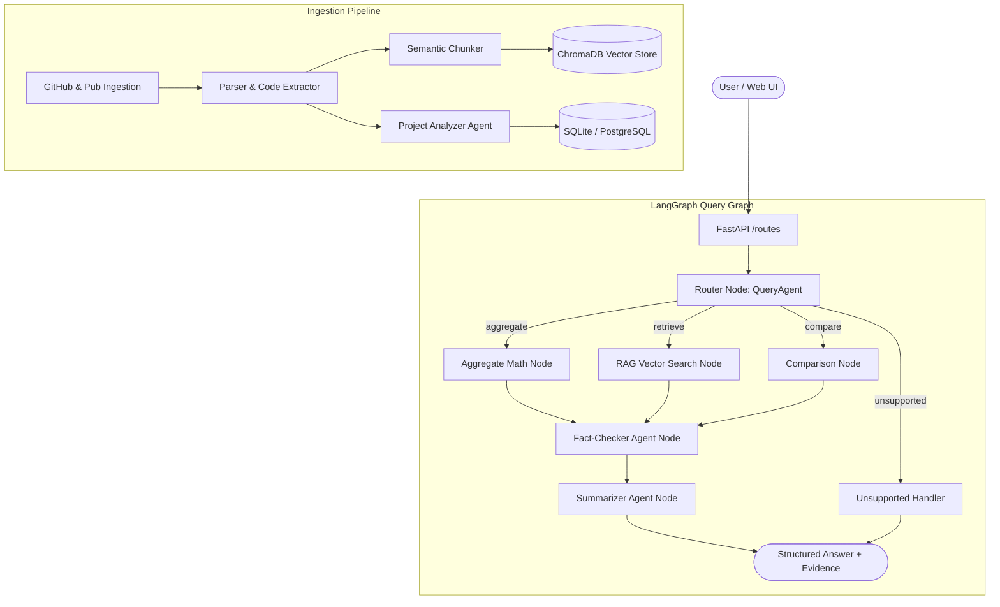

# 🔍 Cross-Publication Insight Assistant

> **A state-of-the-art Multi-Agent AI system built with LangGraph, FastAPI, and OpenRouter for ingesting, analyzing, and synthesizing cross-repository patterns, architectural trends, and technology adoption across public GitHub repositories and Ready Tensor publications.**

---

## 📑 Table of Contents
- [Architecture & Workflow](#-architecture--workflow)
- [Key Features](#-key-features)
- [Implementation Phases](#-implementation-phases)
- [Getting Started](#-getting-started)
  - [Prerequisites](#prerequisites)
  - [Local Installation](#local-installation)
  - [Environment Configuration](#environment-configuration)
- [Running with Docker](#-running-with-docker)
- [Evaluation & Benchmarking](#-evaluation--benchmarking)
- [API Reference](#-api-reference)
- [Testing](#-testing)

---

## 🏗 Architecture & Workflow

The system unifies specialized agents, deterministic math engines, vector databases, and verification guardrails into a single stateful **LangGraph** workflow.



### Specialized Agents:
1. **Project Analyzer Agent (`gpt-4o` via OpenRouter)**: Analyzes project structures, package manifests, and code snippets to extract structured metadata (frameworks, LLMs, storage, architectures, confidence scores).
2. **Query / Router Agent**: Classifies natural language questions into execution branches (`aggregate`, `retrieve`, `compare`, `unsupported`) and extracts targeted search terms.
3. **Fact-Checker Agent**: Verifies claims against source evidence chunks and mathematical calculations, outputting verification statuses (`verified`, `partial`, `unverified`) with citations to eliminate hallucinations.
4. **Summarizer Agent**: Synthesizes verified findings, metrics, and citations into natural language answers.

---

## ✨ Key Features

- 🐙 **Repository Ingestion**: Automated extraction of trees, README files, requirements, config manifests, and code files from GitHub repositories.
- 📐 **Deterministic Aggregation**: Precise mathematical calculation of technology percentages and frequencies across analyzed codebases without LLM arithmetic errors.
- 🔎 **Semantic Hybrid Retrieval**: Vector retrieval (ChromaDB + OpenAI embeddings via OpenRouter) filtered by project IDs and semantic similarity.
- 🛡 **Anti-Hallucination Fact-Checking**: Verification layer ensuring all generated claims are grounded in extracted evidence.
- ⚡ **RESTful FastAPI Backend**: Async endpoints for project ingestion, batch analysis, health checks, and LangGraph query execution.
- 🎨 **Modern Streamlit UI**: Interactive dashboard for submitting repository URLs, browsing indexed repositories, asking queries, and viewing fact-check badges.
- 📊 **Comprehensive Evaluation Framework**: Automated benchmarking suite evaluating router accuracy, fact-checker precision, and aggregation math.

---

## 🚀 Implementation Phases

| Phase | Description | Key Modules |
|---|---|---|
| **Phase 1** | Project Structure & Configuration | [`app/config.py`](file:///app/config.py), [`.env.example`](file:///.env.example) |
| **Phase 2** | GitHub Ingestion & Repository Parsing | [`app/tools/github.py`](file:///app/tools/github.py), [`app/ingestion/parser.py`](file:///app/ingestion/parser.py) |
| **Phase 3** | Project Analyzer & Structured Output | [`app/agents/project_analyzer.py`](file:///app/agents/project_analyzer.py), [`app/schemas/`](file:///app/schemas/) |
| **Phase 4** | PostgreSQL & Vector Storage Layer | [`app/database/models.py`](file:///app/database/models.py), [`app/database/vector_store.py`](file:///app/database/vector_store.py) |
| **Phase 5** | Semantic RAG Retrieval | [`app/ingestion/chunker.py`](file:///app/ingestion/chunker.py), [`app/tools/repository_search.py`](file:///app/tools/repository_search.py) |
| **Phase 6** | Deterministic Aggregate Calculations | [`app/tools/aggregate_calculations.py`](file:///app/tools/aggregate_calculations.py) |
| **Phase 7** | Fact-Checker Agent | [`app/agents/fact_checker.py`](file:///app/agents/fact_checker.py) |
| **Phase 8** | Summarizer Agent | [`app/agents/summarizer.py`](file:///app/agents/summarizer.py) |
| **Phase 9** | LangGraph State Graph & Routing | [`app/graph/workflow.py`](file:///app/graph/workflow.py), [`app/graph/state.py`](file:///app/graph/state.py) |
| **Phase 10** | FastAPI REST API & Streamlit UI | [`app/api/routes.py`](file:///app/api/routes.py), [`frontend/streamlit_app.py`](file:///frontend/streamlit_app.py) |

---

## 🛠 Getting Started

### Prerequisites
- Python 3.10+
- OpenRouter API Key (or OpenAI API key)

### Local Installation

1. **Clone the repository:**
   ```bash
   git clone https://github.com/your-username/Cross-Publication-Insight-Assistant.git
   cd Cross-Publication-Insight-Assistant
   ```

2. **Create and activate a virtual environment:**
   ```bash
   python -m venv .venv
   # Windows:
   .venv\Scripts\activate
   # Linux/macOS:
   source .venv/bin/activate
   ```

3. **Install dependencies:**
   ```bash
   pip install -r requirements.txt
   ```

### Environment Configuration

Create a `.env` file from the provided example:
```bash
cp .env.example .env
```

Configure your OpenRouter API key in `.env`:
```env
# OpenRouter API Key & Provider
OPENROUTER_API_KEY=sk-or-v1-your-key-here
OPENROUTER_BASE_URL=https://openrouter.ai/api/v1
OPENROUTER_MODEL=openai/gpt-4o

# Database & Chroma Storage
DATABASE_URL=sqlite:///./insight.db
CHROMA_PERSIST_DIRECTORY=./chroma_data
```

### Running the Application

1. **Start the FastAPI Backend:**
   ```bash
   uvicorn app.main:app --host 0.0.0.0 --port 8000 --reload
   ```

2. **Start the Streamlit Frontend (in a second terminal):**
   ```bash
   streamlit run frontend/streamlit_app.py
   ```
   * Frontend: [http://localhost:8501](http://localhost:8501)
   * API Docs: [http://localhost:8000/docs](http://localhost:8000/docs)

---

## 🐳 Running with Docker

Run both the FastAPI backend and Streamlit dashboard in isolated containers using Docker Compose:

1. **Build and start services:**
   ```bash
   docker compose up --build
   ```

2. **Access services:**
   - **Streamlit Web UI**: [http://localhost:8501](http://localhost:8501)
   - **FastAPI Documentation**: [http://localhost:8000/docs](http://localhost:8000/docs)
   - **Health Check**: [http://localhost:8000/health](http://localhost:8000/health)

3. **Stop containers:**
   ```bash
   docker compose down
   ```

---

## 📈 Evaluation & Benchmarking

The system includes a dedicated evaluation suite ([`app/evaluation/`](file:///app/evaluation/)) to benchmark:
- **Router Classification Accuracy**: Precision on identifying `aggregate`, `retrieve`, `compare`, and `unsupported` query intents.
- **Fact-Checker Precision**: Correctness in classifying true claims as `verified` and unsupported/hallucinated claims as `unverified`.
- **Deterministic Aggregation Precision**: Correctness of counts, ratios, and percentages across variable datasets.

### Running the Evaluation Suite:
```bash
python evaluation/run_eval.py
```

### Benchmark Metrics:
| Evaluation Component | Benchmark Metric | Target | Output Report |
|---|---|---|---|
| **Query Routing** | Intent Classification Accuracy | > 95% | `evaluation_results.json` |
| **Fact-Checker** | Ground-Truth Verification Accuracy | > 90% | `evaluation_results.json` |
| **Aggregate Engine** | Mathematical Determinism & Precision | 100% | `evaluation_results.json` |

---

## 📡 API Reference

### 1. `GET /health`
Returns service status.
```bash
curl -X GET http://localhost:8000/health
```

### 2. `POST /projects/analyze`
Ingests, extracts files, runs the Project Analyzer Agent, and indexes chunks into ChromaDB.
```bash
curl -X POST http://localhost:8000/projects/analyze \
  -H "Content-Type: application/json" \
  -d '{
    "urls": ["https://github.com/langchain-ai/langgraph"],
    "source_type": "github"
  }'
```

### 3. `POST /query`
Executes the LangGraph query workflow over indexed repositories.
```bash
curl -X POST http://localhost:8000/query \
  -H "Content-Type: application/json" \
  -d '{
    "user_query": "What percentage of projects use LangGraph?"
  }'
```
**Sample Response:**
```json
{
  "answer": "Based on the analyzed repositories, 1 of 1 projects (100.0%) uses LangGraph.",
  "query_type": "aggregate",
  "fact_check_status": "verified"
}
```

### 4. `GET /projects`
Lists all indexed projects in the database.
```bash
curl -X GET http://localhost:8000/projects
```

---

## 🧪 Testing

Run unit and integration tests across all 10 phases using `pytest`:

```bash
# Run all tests
python -m pytest

# Run tests with verbose output
python -m pytest -v

# Run evaluation test suite
python -m pytest tests/test_evaluation.py -v
```
